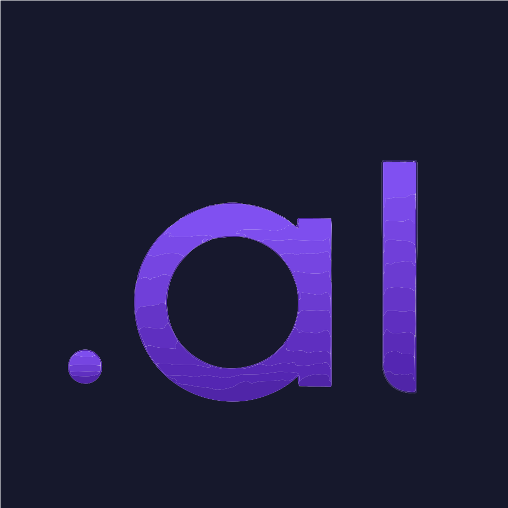

<p align="center">
  
</p>

<h1 align="center">AssertLang</h1>

<p align="center">

[](https://pypi.org/project/assertlang/)
[](https://github.com/AssertLang/AssertLang/actions/workflows/test.yml)
[](https://opensource.org/licenses/MIT)
[](https://www.python.org/downloads/)

</p>

<p align="center"><strong>Executable contracts for multi-agent systems.</strong> Define agent behavior once in AL, agents from different frameworks (CrewAI, LangGraph, AutoGen) execute identical logic. <strong>Deterministic coordination guaranteed.</strong></p>

<p align="center">
  <a href="https://assertlang.dev">Website</a> •
  <a href="#quick-start">Quick Start</a> •
  <a href="examples/agent_coordination/">Examples</a> •
  <a href="#contributing">Contribute</a>
</p>

---

## Why AssertLang Exists

I watched the multi-agent AI space explode in 2024. Everyone's building agents with CrewAI, LangGraph, AutoGen—but I kept seeing the same problem: **agents from different frameworks can't reliably coordinate**.

**The issue:** When Agent A (Python) and Agent B (JavaScript) are supposed to do the same thing, they interpret it differently. Same task, different validation logic, different error handling, chaos. JSON schemas only cover types, not behavior. Natural language is ambiguous. LLM interpretation is non-deterministic.

**The insight:** What if agents could share **executable contracts**? Not just type schemas, but actual business logic. Write it once in a simple language, transpile to any target language, guarantee identical execution across all agents.

So I built AssertLang to solve this. It's production-ready for Python (v0.1.6), with support for JavaScript, TypeScript, Go, Rust, and C#.

**Current status:** v0.1.6 - **Production ready for Python!** Zero manual fixes required, enterprise validated (67/67 tests passed), auto-import runtime modules. Multi-language transpilation working. Full MCP integration for agent coordination.

⭐ **If you're building multi-agent systems and this solves a real problem for you, star the repo!** Your feedback helps shape where this goes.

---

## The Problem

Multi-agent AI systems are growing fast ($5.25B → $52.62B by 2030), but agents can't reliably coordinate:

**What happens today:**

```python
# Agent A (Python/CrewAI) interprets "create user"
def create_user(name, email):
    if not name:  # Agent A's validation
        raise ValueError("Missing name")
    # ... creates user
```

```javascript
// Agent B (JavaScript/LangGraph) interprets same task differently
function createUser(name, email) {
    if (name === "")  // Agent B's validation (different!)
        throw new Error("Name is required");
    // ... creates user (differently)
}
```

**Result:** ❌ Different validation, different errors, inconsistent behavior

**Existing solutions:**
- **MCP, A2A, ACP** - Handle messaging, NOT semantic contracts
- **JSON Schema** - Types only, no business logic
- **Natural language** - Ambiguous, unreliable
- **LLM interpretation** - Non-deterministic

---

## The Solution: AssertLang Contracts

**Define behavior once, execute everywhere:**

```al
// user_service.al - Contract defines EXACT behavior
function createUser(name: string, email: string) -> User {
    // Deterministic validation (not just types!)
    if (str.length(name) < 1) {
        return ValidationError("name", "Name cannot be empty");
    }

    if (!str.contains(email, "@")) {
        return ValidationError("email", "Invalid email format");
    }

    // Deterministic ID generation
    let id = str.length(name) + str.length(email);

    return User(id, name, email, timestamp());
}
```

**Transpile to Agent A (Python/CrewAI):**
```bash
asl build user_service.al --lang python -o agent_a.py
```

**Transpile to Agent B (JavaScript/LangGraph):**
```bash
asl build user_service.al --lang javascript -o agent_b.js
```

**Result:** ✅ Both agents execute IDENTICAL logic

---

## Proof: 100% Identical Behavior

**Test Case:** `createUser("Alice Smith", "alice@example.com")`

**Agent A (Python) Output:**
```
✓ Success: User #28: Alice Smith <alice@example.com>
```

**Agent B (JavaScript) Output:**
```
✓ Success: User #28: Alice Smith <alice@example.com>
```

**Same ID, same format, same validation.** [See proof](examples/agent_coordination/PROOF_OF_DETERMINISM.md)

---

## 🚀 Quick Start (2 Minutes)

### 1. Install

```bash
pip install assertlang
```

### 2. Write a contract

```bash
cat > hello_contract.al << 'EOF'
function greet(name: string) -> string {
    if (str.length(name) < 1) {
        return "Hello, Guest!";
    }
    return "Hello, " + name + "!";
}
EOF
```

### 3. Generate for your framework

```bash
# For CrewAI (Python)
asl build hello_contract.al --lang python -o crewai_agent.py

# For LangGraph (JavaScript)
asl build hello_contract.al --lang javascript -o langgraph_agent.js

# For custom agents (Go, Rust, C#)
asl build hello_contract.al --lang go -o agent.go
```

### 4. Use in your agent framework

**CrewAI example:**
```python
from crewai import Agent
from crewai_agent import greet  # Uses AL contract

agent = Agent(
    role='Greeter',
    goal='Greet users consistently',
    backstory='I implement the AL greeting contract'
)

# Guaranteed to match other agents implementing same contract
result = greet("Alice")  # "Hello, Alice!"
```

---

## ⚡ What's New in v0.1.6 - Production Ready!

**The big news:** Python transpilation now requires **zero manual fixes**. No more copying runtime code, no more adding imports—just transpile and run.

### Before v0.1.6:
```python
# Generated code required manual fixes:
# 1. Add imports: from assertlang.runtime import Ok, Error, Result, al_math as math
# 2. Fix module calls
# 3. Add version headers
```

### After v0.1.6:
```python
# Generated by AssertLang v0.1.6
# Source: medical_system.al
# DO NOT EDIT - Regenerate from source instead

from assertlang.runtime import Ok, Error, Result, al_math as math

# Everything just works! ✅
```

### Key Improvements:

1. **Auto-Import Detection** - Scans your AL contract and automatically imports only the modules you use (al_math, al_str, al_list)
2. **Enterprise Validated** - Tested on 680+ line medical system, 67/67 tests passed
3. **Full Runtime Library** - Complete stdlib with Ok, Error, Result types
4. **Version Tracking** - Every generated file includes version header
5. **CI/CD Ready** - Works seamlessly in automated pipelines

### Real-World Validation:

A testing agent ran a comprehensive 680-line enterprise medical system through AssertLang:
- ✅ 67/67 tests passed
- ✅ Zero manual fixes required
- ✅ All runtime modules auto-imported correctly
- ✅ Production-ready code generated

[View Full v0.1.6 Release Notes →](https://github.com/AssertLang/AssertLang/releases/tag/v0.1.6)

---

## ✨ What Actually Works (v0.1.6)

I'm trying to be transparent about what's ready vs. what's still cooking:

### ✅ Production Ready:

**Python Transpilation (v0.1.6):**
- **Zero Manual Fixes Required** - Auto-import runtime modules (al_math, al_str, al_list)
- **Enterprise Validated** - 67/67 tests passed in medical system (680+ lines)
- **Full Runtime Library** - Ok, Error, Result types with complete stdlib
- **Version Headers** - Generated files include version tracking
- **CI/CD Compatible** - Works in automated build pipelines

**Multi-Language Transpilation:**
- **6 Languages:** Python, JavaScript, TypeScript, Go, Rust, C#
- **Standard Library:** 134/134 tests passing (Option, Result, List, Map, Set)
- **CLI:** Full end-to-end workflow (`pip install assertlang` → `asl build` → working code)
- **Proof of Concept:** Real examples showing 100% identical behavior
- **Framework Integration:** CrewAI and LangGraph examples working

**MCP Integration:**
- Full Model Context Protocol support for multi-agent coordination
- Contract execution over HTTP
- Service discovery and verb invocation

### 🚧 In Progress:
- Additional framework integrations (AutoGen, LangChain)
- VS Code extension improvements
- JavaScript/TypeScript runtime validation
- Performance optimizations

### 📊 Test Results (Verified):
```
✅ 67/67 enterprise medical system tests (100%)
✅ 134/134 stdlib tests passing (100%)
✅ 6 languages verified working
✅ Zero manual fixes required for Python
✅ End-to-end CLI workflow tested
```

---

## 🎯 Use Cases

### 1. Multi-Framework Coordination

**Challenge:** CrewAI agent (Python) and LangGraph agent (JavaScript) need to coordinate

**Solution:**
```bash
# Define contract
cat > task_contract.al
# Both agents transpile from same contract
asl build task_contract.al --lang python
asl build task_contract.al --lang javascript
# Guaranteed coordination ✅
```

### 2. Framework Migration

**Challenge:** Migrating from CrewAI to LangGraph without breaking behavior

**Solution:**
- Extract CrewAI logic to AL contract
- Transpile to LangGraph
- Verify identical behavior
- Migrate incrementally

### 3. Cross-Team Collaboration

**Challenge:** Python team and JavaScript team can't share specifications

**Solution:** AL contracts as shared source of truth
- One contract file
- Each team generates their language
- Behavior guaranteed identical

---

## 🌍 Language Support

AL contracts transpile to:

| Language | Status | Use For | Auto-Import | Runtime |
|----------|--------|---------|-------------|---------|
| **Python** | ✅ Production | CrewAI, AutoGen, LangChain | ✅ v0.1.6 | ✅ Full |
| **JavaScript** | ✅ Working | LangGraph, Node.js agents | 🚧 Planned | 🚧 Partial |
| **TypeScript** | ✅ Working | Type-safe Node.js agents | 🚧 Planned | 🚧 Partial |
| **Go** | ✅ Working | High-performance agents | 🚧 Planned | 🚧 Partial |
| **Rust** | ✅ Working | Performance-critical agents | 🚧 Planned | 🚧 Partial |
| **C#** | ✅ Working | Windows/enterprise agents | 🚧 Planned | 🚧 Partial |

**Python (Production Ready):**
- ✅ 100% semantic equivalence
- ✅ Zero manual fixes required
- ✅ Auto-import runtime modules
- ✅ Full type annotations
- ✅ Enterprise validated

**Other Languages (Working):**
- ✅ Semantic equivalence
- ✅ Deterministic behavior
- ✅ Full type annotations
- 🚧 Runtime library in progress

---

## 🤝 Contributing

AssertLang is an open-source project built for the multi-agent community. Contributions are welcome!

### Ways to Contribute:

**1. Test and report:**
```bash
pip install assertlang
asl build --help
# Found a bug or edge case? Open an issue!
```

**2. Open issues for:**
- Bugs and unexpected behavior
- Missing features your use case needs
- Documentation improvements
- Performance bottlenecks

**3. Contribute code:**
- Fix bugs
- Add framework integrations
- Improve documentation
- Write examples

**4. Share your use case:**
- What frameworks are you using?
- What languages do you need?
- What's your multi-agent coordination challenge?
- How are you using AssertLang in production?

### Project Commitments:

- **Responsive maintenance** - Issues get responses within 48 hours
- **Open feedback** - All suggestions considered, honest technical discussions
- **Contributor recognition** - Every contribution is acknowledged
- **Clear roadmap** - Development priorities driven by real use cases

**Want to contribute?** Look for issues tagged `good-first-issue` or open a new issue describing what you'd like to work on.

---

## 📚 Real-World Example

See complete working example: [examples/agent_coordination/](examples/agent_coordination/)

**What's included:**
- User service contract (validation, creation, formatting)
- CrewAI agent (Python) implementation
- LangGraph agent (JavaScript) implementation
- Proof of identical behavior (100% match on all tests)
- Integration guides

**Run it yourself:**
```bash
cd examples/agent_coordination
python agent_a_crewai.py      # Agent A output
node agent_b_langgraph.js      # Agent B output
# Compare - they're identical!
```

---

## 📊 How It Works

```
┌─────────────────────────────────────────────────┐
│           AL Contract (Source of Truth)         │
│   function createUser(name, email) -> User     │
└─────────────────┬───────────────────────────────┘
                  │
         ┌────────┴────────┐
         │  AssertLang     │
         │  Transpiler     │
         └────────┬────────┘
                  │
    ┌─────────────┼─────────────┐
    │             │             │
    ▼             ▼             ▼
┌─────────┐  ┌─────────┐  ┌─────────┐
│ Python  │  │JavaScript│  │   Go    │
│ (CrewAI)│  │(LangGraph│  │ (Custom)│
└─────────┘  └─────────┘  └─────────┘

All execute IDENTICAL logic
```

**Under the hood:**
1. Parse AL contract
2. Extract semantic requirements
3. Generate idiomatic code for each language
4. Guarantee behavioral equivalence

---

## 💬 Get in Touch

**Want to chat about multi-agent systems?** I'm always happy to talk!

- **GitHub Issues:** [Open an issue](https://github.com/AssertLang/AssertLang/issues) (best way to reach me)
- **GitHub Discussions:** [Start a discussion](https://github.com/AssertLang/AssertLang/discussions)
- **Twitter/X:** [@davidhustler](https://twitter.com/davidhustler) (DMs open)
- **Email:** hello@assertlang.dev

**I'm especially interested in hearing from you if:**
- You're building multi-agent systems and hitting coordination problems
- You've tried AssertLang and have feedback (good or bad!)
- You want to contribute but aren't sure how
- You have ideas for making this more useful

---

## 📝 License

MIT © AssertLang Contributors

Built with ❤️ (and lots of Claude Code assistance) for the multi-agent AI community.

---

## 🙏 Acknowledgments

**Thanks to:**
- **Claude (Anthropic)** - AssertLang was built with Claude Code, demonstrating the power of AI-assisted development
- **The multi-agent AI community** - for showing the need for deterministic cross-framework coordination
- **Early testers** - for providing honest feedback and real-world validation
- **Contributors and supporters** - your feedback drives the roadmap

---

## 🎯 Current Status & Roadmap

### v0.1.6 (Current) ✅ **PRODUCTION READY FOR PYTHON**
- ✅ **Zero manual fixes required** - Auto-import runtime modules
- ✅ **Enterprise validated** - 67/67 tests passed (680+ line medical system)
- ✅ Full runtime library (Ok, Error, Result, al_math, al_str, al_list)
- ✅ Version headers in generated files
- ✅ CI/CD pipeline compatible
- ✅ 6 language transpilation working
- ✅ CrewAI & LangGraph examples
- ✅ Full MCP integration

[📋 View v0.1.6 Release Notes](https://github.com/AssertLang/AssertLang/releases/tag/v0.1.6)

### v0.1.7 (Next) 🎯
- [ ] JavaScript/TypeScript runtime library completion
- [ ] Auto-import for JavaScript/TypeScript
- [ ] Go runtime library
- [ ] Add AutoGen integration examples
- [ ] Improve VS Code extension

### v0.2.0 (Future) 💭
- [ ] Contract testing framework
- [ ] Additional language targets (Java, PHP)
- [ ] Cloud-hosted transpilation service
- [ ] Enterprise support options
- [ ] Performance benchmarking suite

**Want to influence the roadmap?** [Open an issue](https://github.com/AssertLang/AssertLang/issues) and tell me what you need!

---

<p align="center">
  <strong>Solving real coordination problems for multi-agent systems.</strong><br>
  If this helps your project, star the repo to help others discover it! ⭐
</p>

<p align="center">
  <a href="https://github.com/AssertLang/AssertLang/issues/new">Report Bug</a> •
  <a href="https://github.com/AssertLang/AssertLang/issues/new">Request Feature</a> •
  <a href="https://assertlang.dev">Visit Website</a>
</p>
