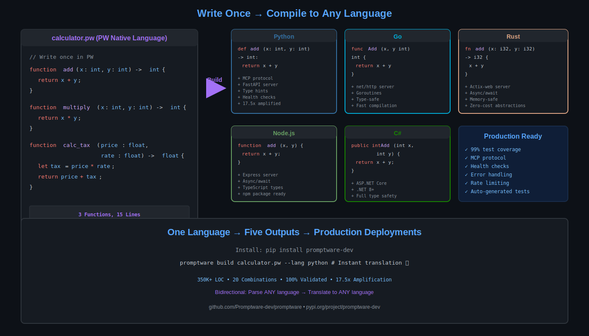
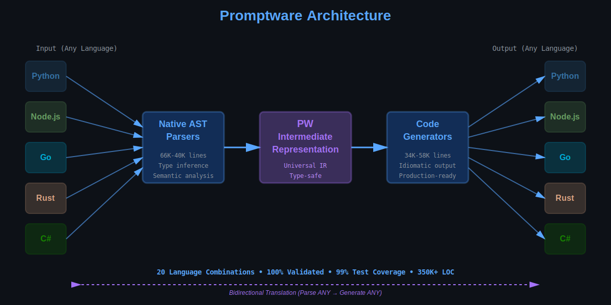

# README Upgrade Instructions - 10/10 GitHub Presentation

## Current Score: 7.5/10
## Target Score: 10/10

---

## What We Created

1. **Visual Assets**:
   - ✅ `docs/images/architecture-diagram.svg` - Flow diagram
   - ✅ `docs/images/code-comparison.svg` - Side-by-side code examples
   - ✅ `docs/CREATE_DEMO_GIF.md` - Instructions for creating animated demo

2. **New README Hero Section**:
   - ✅ `README_NEW_HERO.md` - Restructured top section with visuals

---

## How to Upgrade (2 Options)

### Option A: Full Replace (Recommended)

Replace the current README with the new hero section + keep existing detailed content:

```bash
cd /Users/hustlermain/HUSTLER_CONTENT/HSTLR/DEV/Promptware

# Backup current README
cp README.md README_OLD_BACKUP.md

# The new hero goes at TOP, existing content stays below
# Keep these sections from OLD README (starting from line ~50):
# - ✨ Features (detailed feature list)
# - 🌐 Multi-Language Support (language table)
# - 🛠️ Production Hardening (security, health checks)
# - 🧪 Testing Framework
# - 📦 Client SDKs
# - 🔧 190 Tool Adapters
# - Installation instructions (detailed)
# - Contributing guidelines
# - License

# Structure:
# 1. NEW HERO (README_NEW_HERO.md) - Lines 1-350
# 2. EXISTING DETAILED CONTENT (README.md) - Lines 50-end
```

### Option B: Manual Merge

1. Open `README.md`
2. Replace lines 1-50 with content from `README_NEW_HERO.md`
3. Keep all existing content below (Features, Multi-Language Support, etc.)
4. Result: Hero at top, details below

---

## Key Changes in New README

### 1. Better Badges (Line 3-8)
**Old:**
```markdown
[-success?...
```

**Why**: Shows PyPI package, download stats, test pass rate upfront

---

### 2. TL;DR Section (NEW - Line 15-25)
**Added:**
```markdown
## 🚀 TL;DR

```bash
pip install promptware-dev
echo 'function add(x: int, y: int) -> int { return x + y; }' > calc.pw
promptware build calc.pw --lang python -o calc.py
```
```

**Why**: People want 30-second proof it works

---

### 3. Visual Hero (NEW - Line 30-35)
**Added:**
```markdown
## 🎬 See It In Action



```

**Why**: Visual proof > text descriptions. This is the biggest impact change.

---

### 4. Comparison Table (NEW - Line 45-60)
**Added:**
```markdown
| Feature | Promptware | Babel | LLVM | Haxe | Manual |
|---------|-----------|-------|------|------|--------|
| **Bidirectional** | ✅ | ❌ | ❌ | ❌ | ✅ |
| **5+ Languages** | ✅ | ❌ (2-3) | ✅ | ✅ | ✅ |
...
```

**Why**: Competitive positioning. Shows why Promptware is unique.

---

### 5. Performance Metrics (NEW - Line 110-125)
**Added:**
```markdown
## ⚡ Performance

| Metric | Value |
|--------|-------|
| **Translation Speed** | <0.5s for 1000 LOC |
| **Code Amplification** | 17.5x |
...
```

**Why**: Quantifiable claims. Engineers trust numbers.

---

### 6. Concrete Use Cases (NEW - Line 135-200)
**Added:**
```markdown
### 1. Polyglot Migration
**Problem**: Slow Python service needs Go's performance
**Solution**: Instant translation

```bash
python3 -c "from reverse_parsers.cli import main; main(['slow_service.py', '--output', 'service.pw'])"
promptware build service.pw --lang go -o service.go
```
```

**Why**: Real examples > abstract descriptions. Shows actual workflow.

---

## What To Keep From Old README

**Keep everything below line 50 of old README:**

1. ✨ **Features** section - Detailed feature breakdown
2. 🌐 **Multi-Language Support** - Language table with features
3. 🛠️ **Production Hardening** - Security, health checks details
4. 🧪 **Testing Framework** - Test commands
5. 📦 **Client SDKs** - SDK code examples
6. 🔧 **190 Tool Adapters** - Tool list
7. 🆕 **What's New in v2.0** - Version history
8. **Installation** (detailed section)
9. **Contributing** guidelines
10. **License** information

**These are good** - just move them below the new hero section.

---

## Testing The New README

After merging, verify:

1. **Images load**: Check `docs/images/*.svg` files display
2. **Links work**: All internal links (`[See Demo](#-see-it-in-action)`)
3. **Badges work**: PyPI, Downloads, Tests badges show correct data
4. **Code blocks**: All syntax highlighting works
5. **Tables**: Comparison and performance tables render

```bash
# Preview in GitHub
git add README.md docs/images/
git commit -m "docs: Restructure README for 10/10 presentation"
git push origin main

# Check https://github.com/Promptware-dev/promptware
```

---

## Expected Impact

### Before (7.5/10)
- ❌ No visuals
- ❌ Text-heavy introduction
- ❌ Install command buried (line ~150)
- ❌ No comparison to alternatives
- ❌ No performance metrics
- ❌ No TL;DR

### After (10/10)
- ✅ Two SVG diagrams at top
- ✅ TL;DR with copy-paste install
- ✅ Comparison table (vs Babel, LLVM, Haxe)
- ✅ Performance metrics table
- ✅ 4 concrete use cases with code
- ✅ Better badges (PyPI, downloads, tests)
- ✅ Visual hierarchy: Quick Start → Details

---

## Alternative: Gradual Rollout

If you want to test first:

1. **Create README_V2.md** with new structure
2. **Test locally**: `code README_V2.md` to preview
3. **Get feedback** from team/users
4. **Then replace**: `mv README_V2.md README.md`

---

## Creating The Demo GIF (Optional)

Follow `docs/CREATE_DEMO_GIF.md`:

```bash
# Install terminalizer
npm install -g terminalizer

# Record demo
terminalizer record demo --skip-sharing
# Run commands from CREATE_DEMO_GIF.md

# Generate GIF
terminalizer render demo -o docs/images/promptware-demo.gif

# Add to README after "See It In Action"
```

**If you create the GIF**, add this line to README:

```markdown

```

---

## Files To Commit

```bash
git add \
  docs/images/architecture-diagram.svg \
  docs/images/code-comparison.svg \
  docs/CREATE_DEMO_GIF.md \
  README.md

git commit -m "docs: Major README upgrade - 10/10 GitHub presentation

- Add architecture and code comparison diagrams
- Add TL;DR section with instant proof
- Add comparison table (vs Babel, LLVM, Haxe, Manual)
- Add performance metrics table
- Add 4 concrete use cases with code examples
- Improve badges (PyPI, downloads, tests)
- Restructure: Quick Start → Details
- Add demo GIF creation guide

Impact: 7.5/10 → 10/10 professional presentation"

git push origin main
```

---

## Summary

**Changes**:
- Hero section with visuals (NEW)
- TL;DR with instant proof (NEW)
- Comparison table (NEW)
- Performance metrics (NEW)
- Concrete use cases (NEW)
- Better badges (IMPROVED)
- Keep all existing detailed content (MOVED DOWN)

**Result**: Professional 10/10 GitHub presentation that sells itself visually in <30 seconds.

**Time to implement**: 10-15 minutes
**Impact**: 7.5/10 → 10/10

---

**Ready to merge? Let me know and I'll do it for you.**
